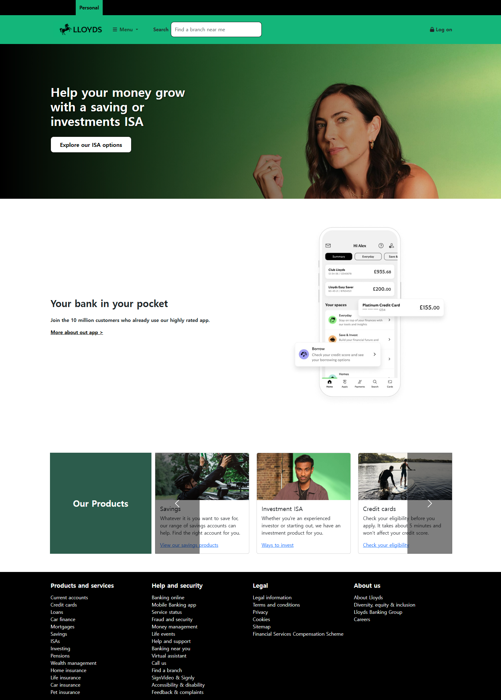

# Lloyds Bank Web clone (In Progress)

# [ Lloyds Bank ](https://ninemovie.netlify.app/)

A responsive web clone of the Lloyds Bank homepage, recreated using HTML, CSS, Bootstrap, and vanilla JavaScript.  
This project aims to replicate the main layout and UI elements of the Lloyds Bank website for learning and portfolio purposes.

## Project Status

**Currently in progress**
The basic layout and styling are complete.  
The responsive navigation bar and product carousel have been implemented using Bootstrap.  
JavaScript interaction enhancements and further features are planned.

## Features
- Responsive navigation bar (built with Bootstrap)  
- Main section with background image and gradient overlay  
- Bank app promotion section  
- Product showcase using Bootstrap carousel  
- Clean and organized footer with service, help, legal, and about sections

## Tech Stack
- HTML5  
- CSS3  
- Bootstrap 5  
- FontAwesome icons  
- JavaScript (functionality to be added)

## Next Steps
- Enhance responsiveness for smaller devices
- Add animations/transitions

## Motivation
This project is part of my UI/UX front-end portfolio. I chose Lloyds Bank because of its clean design, structure, and importance in financial UX design

